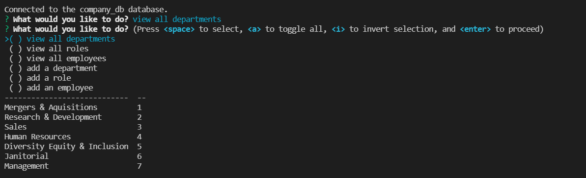
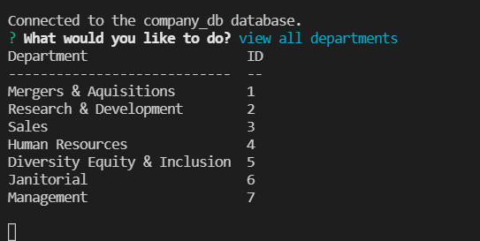

# employeeDatabaseManager

to run the program: 

-remove xxx from .env filename 
-add mysql password to .env file 
-in mysql run db/schema.sql then db/seed.sql 
-npm start 

Important!: 
for now only "view all departments" is a valid selection 
The problem is line 34 in src/prompts 

I would like to use this  kind of logic (prompts inside prompts), but it messes up the display 
I tried many ways, and it always gives the second prompt before displaying the table, and displaces the table headers, like in the picture below: 

  
when it should instead look like this: 
 